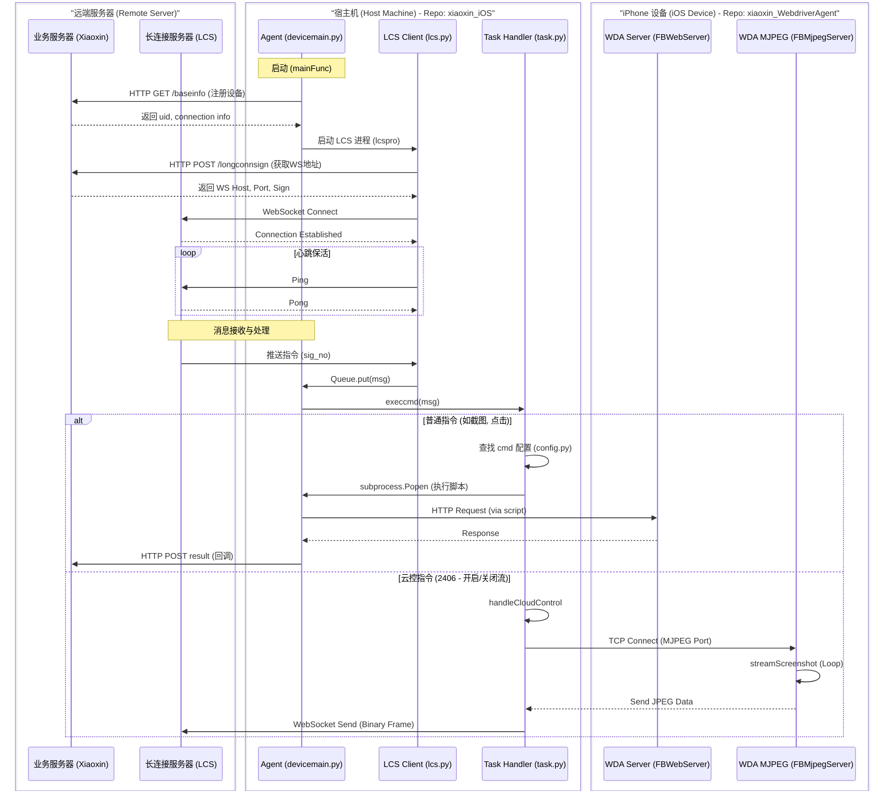

# 1. 项目全貌与架构

欢迎来到 iOS 云真机测试项目的世界。作为一个新人，你可能对“如何通过网页控制一台远端的 iPhone”感到困惑。本章将为你揭开这个“黑魔法”的面纱。

## 1.1 核心问题：我们要做什么？

我们的目标是：**让用户在浏览器中看到 iPhone 的屏幕，并能用鼠标点击操作它。**

这听起来简单，但在 iOS 封闭的生态下，这需要翻越三座大山：

- **屏幕获取**：iOS 不允许后台录屏（除非越狱或使用特定开发工具）。
- **模拟点击**：iOS 不允许应用间互相控制（沙盒机制）。
- **远程传输**：如何将这些数据实时传输到浏览器？

## 1.2 解决方案：WebDriverAgent (WDA)

为了解决前两个问题，业界通用的方案是 Facebook 开源的 **WebDriverAgent (WDA)**。

**什么是 WDA？**

WDA 是一个运行在 iOS 设备上的 App。它利用了 Apple 提供的 `XCTest` 框架（本是用于自动化测试的）。XCTest 拥有极高的权限，可以获取屏幕截图和模拟点击。WDA 启动后，会在手机上开启一个 HTTP 服务器（默认端口 8100），外部可以通过发送 HTTP 请求来控制手机。

## 1.3 整体架构图

本项目采用了经典的 **Host-Device** 架构：

- **云端 (Cloud)**：用户操作的网页端。
- **宿主机 (Host)**：运行 `xiaoxin_iOS` 代码的电脑（通常是 Mac mini）。它通过 USB 连接 iPhone。
- **设备 (Device)**：运行 `xiaoxin_WebdriverAgent` 的 iPhone。

<figure>
  <svg width="600" height="300" viewBox="0 0 600 300">
    <defs>
      <marker id="arrow" markerWidth="10" markerHeight="10" refX="8" refY="3" orient="auto">
        <path d="M0,0 L0,6 L9,3 z" fill="#333" />
      </marker>
    </defs>
    <rect x="50" y="50" width="120" height="80" rx="5" fill="#E3F2FD" stroke="#2196F3" stroke-width="2" />
    <text x="110" y="95" text-anchor="middle" fill="#0d47a1">云端服务器</text>
    <text x="110" y="115" text-anchor="middle" font-size="12" fill="#0d47a1">(Web/Backend)</text>

    <rect x="250" y="50" width="120" height="200" rx="5" fill="#FFF3E0" stroke="#FF9800" stroke-width="2" />
    <text x="310" y="80" text-anchor="middle" fill="#e65100">宿主机 (Mac/Win)</text>
    <text x="310" y="100" text-anchor="middle" font-size="12" fill="#e65100">xiaoxin_iOS</text>

    <rect x="450" y="100" width="100" height="150" rx="10" fill="#F3E5F5" stroke="#9C27B0" stroke-width="2" />
    <text x="500" y="170" text-anchor="middle" fill="#4a148c">iPhone</text>
    <text x="500" y="190" text-anchor="middle" font-size="12" fill="#4a148c">WDA Running</text>

    <line x1="170" y1="90" x2="250" y2="90" stroke="#333" stroke-width="2" marker-end="url(#arrow)" />
    <text x="210" y="80" text-anchor="middle" font-size="10">WebSocket</text>

    <line x1="370" y1="175" x2="450" y2="175" stroke="#333" stroke-width="2" marker-end="url(#arrow)" />
    <text x="410" y="165" text-anchor="middle" font-size="10">USB / HTTP</text>
  </svg>
  <figcaption style={{textAlign: 'center'}}>Host-Device 架构图</figcaption>
  
</figure>

## 1.4 交互流程详解

以下时序图展示了从设备注册到指令执行的完整通信链路：



# 2. 宿主代理 (xiaoxin_iOS)

这是运行在 Mac 电脑上的 Python 程序，它是整个系统的“大管家”。

## 2.1 入口：main.py

一切从 `main.py` 开始。它的主要职责是：**注册设备** 和 **启动消息监听**。

```python
def main(deviceInfo):
    # 1. 获取设备 UDID
    deviceId = deviceInfo['udid'] 
    
    # 2. 向云端注册设备，获取 uid (用于 WebSocket 鉴权)
    info = getiOSuid(deviceInfo)
    
    # 3. 启动 LCS 进程 (Long Connection Service)
    # 为什么要用多进程？因为 WebSocket 需要一直保持连接，不能阻塞主线程。
    q = multiprocessing.Queue()
    lcspro = multiprocessing.Process(target=lcs_task, args=(info['uid'], q, deviceId,))
    lcspro.start()

    # 4. 主循环：不断从队列中取消息并执行
    while True:
        while not q.empty():
            temp = q.get()
            # 执行命令
            execcmd(meslist, wdaPort)
```

这种 **生产者-消费者模型** 是处理异步消息的经典模式。`lcs_task` 负责收信（生产），`main` 负责读信并干活（消费）。这样即使网络卡顿，也不会影响本地命令的执行。

## 2.2 通信兵：lib/lcs.py

这个文件负责与云端保持 WebSocket 长连接。它就像一条“电话线”，时刻等待云端的指令。

```python
class LCS_client:
    def on_message(self, wsapp, message):
        # 收到消息后的回调
        data = json.loads(message)
        if data['sig_no'] == 50003: # 50003 代表业务消息
            msg_list = data['msg_list']
            for msg_data in msg_list:
                # 将消息放入队列，传回给 main 进程
                self.q.put(json.loads(msg_data))
```

**关键点**：`sig_no` 是信号编号。我们定义了一套私有协议，比如 `50003` 是下发指令，`2400` 是截图，`2401` 是点击。

## 2.3 指挥官：task.py

当 `main.py` 拿到消息后，会交给 `task.py` 的 `execcmd` 函数处理。这里是业务逻辑的分发中心。

```python
def execcmd(message, port, deviceId):
    # 2406: 云控指令（开始/结束控制）
    if message['sig_no'] == 2406:
        handleCloudControl(type, deviceId, port)
        return
    
    # 2414: 录屏指令
    if message['sig_no'] == 2414:
        rtask = ScreenRecord(deviceId, port)
        rtask.handleScreenRecord(type, deviceId, content)
        return 

    # 其他指令 (点击、滑动等)
    if message['sig_no'] in config.CALL_BACK_INFO:
        # 拼接命令行，调用外部 Python 脚本执行
        cmdinfo = cmd(message, port)
        subprocess.Popen(cmdinfo, shell=True)
```

# 3. 设备端核心 (WDA)

现在我们将视线转移到 iPhone 上，`xiaoxin_WebdriverAgent` 是我们修改过的 WDA 版本。

## 3.1 WDA 的本质

WDA 本质上是一个 **Web Server**。当你运行它时，它在手机上监听 8100 端口。你给它发 HTTP 请求，它就调用 Apple 的 API 去操作手机。

- **GET /status**: 告诉我手机现在的状态。
- **POST /session/:id/element/active/click**: 点击当前焦点元素。

## 3.2 定制指令：FBCustomCommands.m

为了满足特定需求，我们在 `WebDriverAgentLib/Commands/FBCustomCommands.m` 中添加了自定义路由。

```objectivec
// 路由表：定义 URL 和处理函数的映射
+ (NSArray *)routes
{
  return
  @[
    // 当收到 POST /wda/homescreen 时，执行 handleHomescreenCommand
    [[FBRoute POST:@"/wda/homescreen"].withoutSession respondWithTarget:self action:@selector(handleHomescreenCommand:)],
    [[FBRoute POST:@"/wda/lock"] respondWithTarget:self action:@selector(handleLock:)],
    // ... 更多路由
  ];
}

// 处理函数：回到桌面
+ (id<FBResponsePayload>)handleHomescreenCommand:(FBRouteRequest *)request
{
  NSError *error;
  // 调用 XCTest 的私有 API fb_goToHomescreenWithError
  if (![[XCUIDevice sharedDevice] fb_goToHomescreenWithError:&error]) {
    return FBResponseWithUnknownError(error);
  }
  return FBResponseWithOK();
}
```

当你在网页上点击“Home 键”图标时，云端发送指令 -> 宿主机收到 -> 发送 HTTP POST 请求到 `http://localhost:8100/wda/homescreen` -> WDA 收到请求 -> 执行上述 Objective-C 代码 -> 手机回到桌面。

# 4. 视频流实现原理

这是最复杂也最核心的部分：如何让用户看到画面？

## 4.1 MJPEG 流

WDA 内置了一个 MJPEG Server。简单来说，它就是不断地截图，然后把一张张图片像幻灯片一样发出来。

**MJPEG (Motion JPEG)** 是一种视频压缩格式，其实就是一连串的 JPEG 图片。它的优点是实现简单，延迟极低；缺点是带宽占用大（因为每帧都是完整图片）。

## 4.2 宿主机的接力：screenrecord.py

宿主机并不只是简单转发，它使用了 `ffmpeg` 来处理流。在 `screenrecord.py` 中：

```python
def recordScreen(self, deviceId, msgInfo, dq):
    # ... 省略部分代码
    
    # 构造 ffmpeg 命令
    # -i self.mjpegHost: 输入源，即 http://localhost:8100 (WDA的流)
    # -f mjpeg: 格式
    # outfile: 输出文件
    cmd = FFMPEG_BINARY \
            + " -f mjpeg " \
            + " -r " + str(DEFAULT_FPS) \
            + " -i " + self.mjpegHost \
            + " -y " + outfile 
    
    # 执行命令
    p = subprocess.Popen(cmd, shell=True, ...)
```

**流程解析**：

1. **WDA**: 疯狂截图，提供 `http://localhost:8100` 视频流。
2. **Host (ffmpeg)**: 连接这个 URL，拉取视频流，并将其保存为 MP4 文件（用于回放）或推送到云端（用于直播，通常是推流到 RTMP 服务器）。

在 `task.py` 中还有一个 `getMjpegAndSend` 函数，它直接读取 HTTP 流并通过 WebSocket 发送给前端。这是一种更直接的“直播”方式，用于实时预览。

```python
def getMjpegAndSend(deviceId, localPort, dq):
    # 连接 WDA 的 MJPEG 流
    r = requests.get(requestUrl, stream=True)
    for chunk in r.iter_content(chunk_size=1024):
        # 寻找 JPEG 图片的头(FFD8)和尾(FFD9)
        a = byteData.find(b'\xff\xd8')
        b = byteData.find(b'\xff\xd9')
        if a != -1 and b != -1:
            jpg = byteData[a:b+2]
            # 通过 WebSocket 发送给前端
            kpds.wsApp.send(jpg, ABNF.OPCODE_BINARY)
```

# 5. 触控与交互实现

当你点击浏览器里的手机画面时，发生了什么？

1. **前端**：捕获鼠标点击坐标 (x, y)。由于浏览器里的画面可能是缩放过的，前端需要将其换算成手机真实分辨率的坐标。
2. **云端**：将坐标包装成 JSON，通过 WebSocket 发送给宿主机。
3. **宿主机 (task.py)**：收到 `2401` (点击) 或 `2402` (滑动) 指令。
4. **执行脚本 (2401.py)**：`task.py` 调用对应的脚本。虽然我们没看到 `2401.py` 的源码，但它内部肯定是使用了 `wda` 库（Facebook WDA 的 Python 客户端）。
5. **WDA Client**：发送 HTTP 请求给手机，例如 `POST /session/:id/touch/perform`。
6. **手机 (WDA)**：`FBTouchActionCommands.m` 接收请求，调用 XCTest 模拟手指点击。

**为什么要这么绕？** 为了安全和标准化。Web 端不能直接连手机，必须通过云端中转鉴权。宿主机作为代理，隔离了复杂的网络环境。WDA 则屏蔽了底层的 iOS 硬件差异。

# 6. iOS 版本支持与限制分析

### 1. DeviceSupport 的使用

**涉及组件:** `tidevice`（依赖项）

在 `xiaoxin_iOS` 代码中，并没有直接操作 Developer Disk Image (DeviceSupport) 的代码。这是因为项目依赖 `tidevice` 来管理设备连接和 WDA 启动。

`tidevice` 在启动 WDA 时，会自动检测 iOS 设备版本，并尝试从本地（通常是 Xcode 的安装目录或自定义目录）加载对应的 Developer Disk Image 并挂载到设备上。这是执行 XCTest 和 WDA 的必要前提。

### 2. iOS 16+ 不支持原因分析

**核心原因:** 苹果在 iOS 17 (及 iOS 16 后期) 引入了新的设备通信机制 (CoreDevice)，废弃了传统的 Developer Disk Image 挂载方式。

- **挂载方式变更:** iOS 17 引入了 "Personalized Developer Disk Image" 和基于 CoreDevice 的新通道，旧版 `libimobiledevice` 和 `tidevice` 无法通过旧协议完成挂载。
- **Xcode 依赖:** 支持 iOS 16+ 需要更新版本的 Xcode 和 macOS，而旧的自动化工具链可能尚未适配新的 Xcode 协议。
- **WDA 兼容性:** 虽然 WDA 本身一直在更新，但如果底层的启动工具（`tidevice`）无法与新版 iOS 握手并注入驱动，WDA 就无法启动。

**结论:** 当前架构受限于 `tidevice` 对新版 iOS 协议的支持情况。要支持 iOS 16+，通常需要升级 `tidevice` 到支持 iOS 17 的版本（如 `tidevice3`）或使用 `go-ios` 等新一代工具。

### 3. 关键概念补充

**Developer Disk Image (DDI)**

**定义:** 这是一个包含调试工具（如 `debugserver`）和系统库的磁盘镜像文件。在 iOS 16 及更早版本中，当 Xcode 或自动化工具（如 tidevice）连接设备进行调试或运行测试时，必须将与设备 iOS 版本匹配的 DDI 挂载到设备上。

**作用:** 它是实现真机调试、运行 XCTest (WDA) 的基础。如果没有挂载 DDI，设备将无法响应调试指令。

**Personalized Developer Disk Image (PDDI)**

**定义:** 从 iOS 17 开始引入的新机制。与传统的通用 DDI 不同，PDDI 是针对特定设备进行加密签名的。这意味着不能再简单地将同一个镜像文件挂载到所有相同版本的设备上，而是需要为每台设备获取其专属的签名镜像。

**影响:** 这一变化极大地提高了安全性，但也破坏了现有的自动化工具链（如旧版 tidevice），因为它们无法处理这种新的签名和挂载流程。这也是导致当前架构无法直接支持新版 iOS 的主要技术障碍。

# 7. 总结与调试

## 7.1 知识点回顾

- **WDA** 是基石，它把手机变成了一个 Web 服务器。
- **xiaoxin_iOS** 是桥梁，它把云端的 WebSocket 指令翻译成 WDA 能听懂的 HTTP 请求。
- **MJPEG** 是眼睛，虽然带宽占用大，但胜在兼容性好、延迟低。

## 7.2 常见问题排查 (Troubleshooting)

- **画面黑屏**：
  - 检查 WDA 是否在手机上存活（看宿主机日志有没有 WDA crash）。
  - 检查 `screenrecord.py` 中的 ffmpeg 是否报错。

- **点击无反应**：
  - 检查 `lcs.py` 是否连接正常（日志搜 "pong"）。
  - 检查 `task.py` 是否收到了 `sig_no`。
  - 手动 curl 手机的 8100 端口，看 WDA 是否响应。