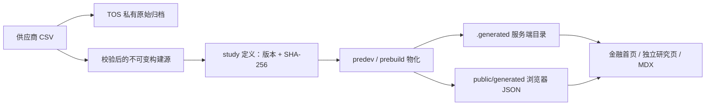

# 数据系统

## 固定阶段市场研究（正式展示链路）

金融频道使用“市场阶段研究”展示指定历史区间内的股票、指数和基准表现。它是可复现的编辑型内容，不是实时行情面板，也不依赖页面请求时的数据 API。



### 设计边界

- **固定区间**：区间由 study 定义锁定，页面不提供任意日期选择器。
- **构建期快照**：浏览器不读取 CSV，不在页面运行时调用 `/api/stocks` 或 `/api/datasets`。
- **失败即停止**：SHA-256 不匹配、日期越界、顺序重复、OHLC 不合法、mock 标记或重复发布 ID 都会令构建失败。
- **可追溯**：页面始终展示数据商、许可、获取日期、复权口径、时区、版本和免责声明。
- **输入隔离**：TOS 原始对象地址和 `input` 配置不会进入浏览器 artifact。
- **无数据不占位**：没有 `status: "published"` 的研究时，金融首页不渲染研究区块，不使用随机数据补位。

旧 `/api/stocks` 的 mock 回退只保留给本地实验和数据采集，不得作为正式研究页数据源。

### 目录与职责

| 路径 | 职责 |
|------|------|
| `data/finance/studies/*.study.json` | 人工审核、可版本控制的研究定义 |
| `src/lib/finance/market-study-schema.ts` | 类型和定义校验 |
| `src/lib/finance/market-study-csv.ts` | CSV 解析与 OHLCV 不变量校验 |
| `src/lib/finance/market-study-metrics.ts` | 阶段收益、年化收益/波动、最大回撤、归一化序列 |
| `src/lib/finance/market-study-materializer.ts` | 下载、哈希验证和 artifact 生成 |
| `src/lib/finance/market-study-loader.ts` | Server Component 目录与研究读取 |
| `scripts/build-finance-studies.ts` | 构建全部已发布研究 |
| `scripts/publish-finance-study.ts` | 校验 CSV 并上传 TOS 私有归档/不可变构建源 |
| `.generated/finance/` | 服务端生成目录，不提交 Git |
| `public/generated/finance/` | 同源浏览器 artifact，不提交 Git |

### CSV 契约

```csv
date,open,high,low,close,adjusted_close,volume
2024-01-02,100.00,103.00,99.00,102.00,101.50,1200000
```

`date/open/high/low/close` 必填；`adjusted_close/volume` 可选。日期必须为 `YYYY-MM-DD`、唯一、严格升序并落在研究区间内。价格必须大于 0，且 `high`/`low` 必须包住开盘与收盘价。不同市场的休市日期不需要对齐，图表使用真实时间戳而非共享分类轴。

### 发布流程

1. 从授权数据源导出日频 OHLCV CSV，并确认许可、复权方式、市场时区和币种。
2. 配置 `.env.local` 中的 TOS 变量，执行：

```bash
npm run finance:publish -- \
  --file=/absolute/path/company.csv \
  --study=company-vs-benchmark-stage \
  --symbol=COMPANY \
  --start=2024-01-01 \
  --end=2024-12-31
```

3. 命令将原始 CSV 私有归档到 `finance/raw/`，将内容寻址的构建源放到 `finance/published/`，并输出 `{ uri, sha256, format }`。
4. 复制 `data/finance/studies/market-study.study.example.json` 为 `<id>.study.json`，填写所有标的和来源信息；审核完成后将 `status` 改为 `published`。
5. 执行 `npm run finance:build`。开发和生产构建也会通过 `predev` / `prebuild` 自动执行。
6. 访问 `/blog/finance/market-studies/<id>`，并在需要引用的文章中使用 `<MarketStudy studyId="<id>" />`。

版本格式为 `YYYY.MM.DD` 或 `YYYY.MM.DD.N`。修改区间、输入文件、复权口径或事件注释时必须创建新版本；同一个 `id` 同时只能有一个 `published` 定义。

### TOS 环境变量

| 变量 | 用途 |
|------|------|
| `TOS_AK` / `TOS_SK` | 显式发布命令使用的访问密钥 |
| `TOS_ENDPOINT` / `TOS_REGION` | TOS 协议端点和地域 |
| `TOS_BUCKET` | 存储桶名称 |
| `TOS_PUBLIC_BASE_URL` | `finance/published/` 对象的公开或 CDN 基础 URL |
| `TOSUTIL_PATH` | 可选，`tosutil` 非 PATH 安装时指定绝对路径 |

这些变量不以 `NEXT_PUBLIC_` 开头，不可写入 study JSON、客户端组件或日志。当前发布脚本使用 `public-read` 的不可变构建源以支持无凭据的 CI 构建；原始归档始终为 `private`。如需把构建源也设为私有，应改为在 CI 中注入短期签名或先同步到受控构建缓存，不能把永久 AK/SK 暴露给浏览器。

### 展示与扩展

默认视图将每个标的起点归一化为 100，适合不同价格量级的横向比较；另提供复权价格、回撤和单标的 K 线/成交量。事件注释只标记时间位置，不自动声明因果关系。

新增股票、基准或指数只需追加 `instruments`。当前 artifact 已保留独立交易日期、市场、币种、角色与 OHLCV，可继续扩展汇率换算、周/月频聚合、股息事件或更多市场；若新增字段改变现有含义，应提升 `schemaVersion`，不要静默复用版本 1。

## 股票数据

`src/lib/stocks/` 采用多提供商架构：

- `fetch.ts` — 入口，负责路由到不同提供商、缓存、降级处理。
- `providers/alpha.ts` — Alpha Vantage（需 `ALPHA_VANTAGE_API_KEY`）。
- `providers/yahoo.ts` — Yahoo Finance（需 `RAPIDAPI_KEY`）。
- `providers/mock.ts` — 降级 mock 数据（无 API Key 时自动回退）。
- `store.ts` — 本地缓存读写（基于存储 key）。

> 此模块属于旧的运行时查询/开发链路。正式市场阶段研究只消费构建期 artifact。

---

## 数据集

### 存储结构

- 存储在 `src/data/datasets/<id>.json`。
- 索引文件 `src/data/datasets/index.json`。
- 支持时间序列（`series[].points[]`）与分类（`items[]`）两种结构。

### API 接口

| 方法 | 路由 | 参数 | 说明 |
|------|------|------|------|
| `GET` | `/api/datasets` | `?type=&tag=&q=` | 列表与过滤，返回 `{ metas: [] }` |
| `GET` | `/api/datasets/:id` | `?type=&from=&to=&series=` | 详情与时间裁剪，`series` 为多选（逗号分隔） |
| `PUT` | `/api/datasets/:id/series/:key` | Body: `{ points: [{t,v}] }` | 本地维护接口；默认禁用写入，需 `ALLOW_API_FILE_WRITES=1` |

缓存策略：两个 GET 接口使用 `public, s-maxage=300, stale-while-revalidate=86400`；PUT 响应使用 `public, s-maxage=60, stale-while-revalidate=300`。

### 前端封装

`src/lib/api/datasets.ts` 提供：

```js
import { listDatasets, getDataset } from '@/lib/api/datasets'

// 列表过滤
const { metas } = await listDatasets({ type: 'timeseries', tag: 'stock' })

// 详情查询（支持时间裁剪和序列选择）
const dataset = await getDataset('my-dataset', {
  from: '2024-01-01',
  to: '2024-12-31',
  series: ['close', 'volume']
})
```

---

## 股票数据 API

| 方法 | 路由 | 参数 | 说明 |
|------|------|------|------|
| `GET` | `/api/stocks` | `?symbols=AAPL,MSFT&start=&end=&rangeId=&source=alpha&prefer=&save=1` | 股票对比数据；默认不写本地缓存 |

参数说明：
- `symbols` — 逗号分隔的股票代码（必填）
- `start` / `end` — 日期范围（YYYY-MM-DD）
- `rangeId` — 预设范围 ID，默认 `default`
- `source` — 数据源：`alpha` 或 `yahoo`，默认 `alpha`
- `prefer` — 优先使用的提供商回退策略
- `save` — 是否保存到本地缓存，`1` 或 `0`，默认 `0`；只有 `ALLOW_API_FILE_WRITES=1` 时 `save=1` 才会写入仓库文件

多提供商架构：`src/lib/stocks/fetch.ts` 会按 `source` 路由到对应提供商，无 API Key 时自动降级到 `mock.ts`。

---

## Notion 集成

> **状态：暂时封存。** 当前站点不再使用 Notion 内容，相关 API、环境变量和本地数据只为保留历史实现，默认开发与部署流程不依赖它们。

- 历史实现位于 `src/app/api/notion/`，使用 `@notionhq/client`；默认返回 `410 Gone`，只有 `ENABLE_ARCHIVED_NOTION_API=1` 时才执行旧逻辑。
- `src/data/notion/` 中的数据不属于当前活跃内容源。
- 不应继续为 Notion 集成新增功能、页面依赖或必填配置。
- 若未来重新启用，应先重新验证 API 权限、数据库字段映射、缓存策略和部署环境变量，再移除封存标记。

---

## 车站印章收藏数据

### 页面定位

印章收藏页是「日本行纪」专栏下的独立收藏体验页，目标不是文章列表或普通相册，而是一个可探索的 **駅スタンプ Atlas**：

- 第一层是紧密 Bento 收藏墙，用来快速浏览大量印章。
- 第二层是单张印章的原地展开详情，用来阅读车站信息、个人故事和可达线路。
- 第三层是筛选与组织方式，用来在 100+ 收藏规模下维持可探索性。

设计原则：

- **收藏墙优先**：默认状态保持高密度、低文字权重，日期、ID、站名只作为边角辅助信息。
- **组织模式优先**：按线路、地域或铁路公司切换时允许 Bento 重排，让同类印章聚集；选中具体分类值后，匹配卡片前置，非匹配卡片弱化。
- **铁路关系优先于表格信息**：可达站用 SVG 线路示意表达，不做地理精确地图。
- **故事在展开层承载**：卡片本体不塞长文，点击后通过 3×2 重排详情卡展示故事和线路。

### 存储位置

`src/data/stamps.ts` —— TypeScript 常量数据文件。当前采用规范化的前端数据表组织，并导出兼容页面使用的派生 `stamps` 数组。

核心导出：

- `stations`：车站主数据，一个车站只维护一次。
- `stampRecords`：印章收藏记录，通过 `stationId` 引用车站。
- `stationRoutes`：车站之间的可达关系，通过 `fromStationId` / `toStationId` 引用车站。
- `stamps`：由以上三组数据组合出的页面渲染数据，保留 `station` 和 `connections` 字段，供 `StampsPageClient` 直接使用。

### 数据结构

```typescript
interface StationInfo {
  id: string;          // 车站稳定 ID
  name: string;        // 駅名
  line: string;        // 线路名
  city: string;        // 城市
  prefecture: string;  // 都道府県
  region: "北海道" | "東北" | "関東" | "甲信越" | "東海" | "近畿" | "北陸" | "中国" | "四国" | "九州" | "沖縄"; // 地域区分
  operator?: string;   // 运营公司（JR東日本 等）
  address?: string;    // 详细地址
  lat?: number;        // 纬度（预留地图用）
  lng?: number;        // 经度（预留地图用）
  railDiagram?: StationRailDiagram; // 无底图铁路线路示意图
}

interface StationRailDiagram {
  viewBox?: string;
  lines: {
    path: string;       // SVG path，使用小画布坐标
    label: string;      // 线路名
    color: string;      // 线路色
    routeType?: "shinkansen" | "railway" | "subway" | "monorail" | "air";
    strokeWidth?: number;
    dashArray?: string;
  }[];
  nodes: {
    label: string;
    stationId?: string;
    x: number;
    y: number;
    role: "current" | "collected" | "direction"; // direction 只作为方向标签，不画站点圆点
  }[];
  badges?: { label: string; color: string }[];
}

interface StampRecord {
  id: string;                  // 收藏编号（如 "087"）
  stationId: string;           // 关联车站 ID
  date: string;                // 收集日期（YYYY/MM/DD）
  collectedAt?: string;        // 具体盖章位置
  images: StampImages;         // 图片 URL 集合（指向 TOS）
  story?: string;              // 与车站的个人故事
  note?: string;               // 简短备注
  size: "square" | "wide" | "large";  // 卡片尺寸（数据中保留，渲染时统一为 280×280 正方形）
}

interface StationRoute {
  fromStationId: string; // 起点车站 ID
  toStationId: string;   // 终点车站 ID
  routeType?: "shinkansen" | "railway" | "subway" | "monorail" | "air";
  line?: string;         // 使用线路
  duration?: string;     // 大致耗时
  label?: string;        // 补充标签
  geometry?: Array<[number, number]>; // 真实线路轨迹，[lng, lat]
}

interface Stamp extends StampRecord {
  station: StationInfo;             // 由 stationId 派生
  connections?: StampConnection[];  // 由 stationRoutes 派生
}

interface StampConnection {
  stationId: string;    // 可抵达车站对应的收藏编号
  routeType?: "shinkansen" | "railway" | "subway" | "monorail" | "air";
  line?: string;
  duration?: string;
  label?: string;
  geometry?: Array<[number, number]>;
}

interface StampImages {
  stamp: string;       // 印章本体照片 → TOS URL（必须）
  station?: string;    // 车站外观照片 → TOS URL（可选）
  context?: string;    // 盖章场景 → TOS URL（可选）
  album?: string[];    // 多张相关照片 → TOS URL 数组（可选）
}
```

这样拆分后，车站基础信息、印章收藏记录、站点关系不再互相重复。页面仍然消费 `stamps`，因此 UI 层不用知道底层数据是否拆表。

### 图片托管

所有印章图片存放于 **火山引擎 TOS** 对象存储：

- Bucket：`blog-assets-asong.tos-cn-beijing.volces.com`
- 建议路径：`stamps/{id}-{station}-stamp.jpg`
- 已在 `next.config.ts` `images.remotePatterns` 中配置白名单，可直接用 `next/image` 加载

### 页面布局

- **无限画布设计**：`StampsPageClient` 使用 3600×3600 的大画布；布局先根据印章数量计算一个尽量紧凑的矩形网格，再把 2×1 Hero 作为普通网格块嵌入其中，新增印章会优先补齐矩形边界，而不是向单一方向追加。
- **滑动交互**：桌面端滚轮/触摸板平移，移动端单指滑动，带惯性衰减。
- **滑动边界**：四个方向以最外围印章边缘外再延伸 180px 为界。
- **卡片尺寸**：渲染时统一为 280×280 的 1:1 正方形，圆角 `rounded-2xl`，卡片间距 6px。
- **展开交互**：点击印章卡后，当前卡片作为真实网格项扩张为 3×2 详情卡，其他印章卡重新排布让出空间，而不是被展开卡覆盖；详情卡展示车站信息、故事文本与基于 `connections` 的 SVG 可达线路动画。
- **线路示意动画**：展开卡右侧优先使用 `station.railDiagram` 渲染无底图铁路线路示意图，表达真实方向、线路品牌色和关键收藏节点。未配置 `railDiagram` 的车站会退回到 `lat/lng` 小范围投影路线图；后续也可把 Overpass / OSM 导出的真实线路点写入 `stationRoutes.geometry`。
- **组织交互**：Hero 卡片底部提供「线路 / 地域 / 铁路公司」三类并列组织入口；切换入口时按对应字段整体分组重排，选中具体线路、地域或铁路公司后，该组卡片前置聚集，其他印章卡片变暗。

### 交互分层

#### 默认卡片

默认卡片承担“收藏墙”的视觉密度：

- 印章图片是主视觉，使用 `object-contain` 居中展示。
- 日期与 ID 放在顶部弱角标，站名放在底部弱标签。
- 图片加载失败时显示轻量「画像未配置」占位，不抢视觉权重。

#### 展开卡片

点击印章卡后，卡片参与 Bento reflow 并展开为 3×2：

- 左上展示车站名、线路、都道府县、运营公司和收集地点。
- 左下展示 `story`，用于承载“我和这个车站的故事”。
- 右侧展示 `connections` 驱动的 SVG 可达线路动画和可达站列表。
- 展开靠近视口边缘的卡片时，画布会自动平移，让详情卡尽量进入可见区域。
- 其他印章卡按同一网格算法重排，让展开卡拥有真实占位，避免覆盖式弹层破坏收藏墙结构。

#### Hero 组织

Hero 卡片是页面的控制中心，当前顶级组织方式为：

- **线路**：按 `stamp.station.line` 生成分类按钮，切换到该模式后按线路分组重排。
- **地域**：按 `stamp.station.region` 生成分类按钮，地域值使用日文汉字（如 `関東`、`近畿`、`北陸`、`九州`）。
- **铁路公司**：按 `stamp.station.operator` 生成分类按钮。

三类组织方式是并列入口。选中具体分类值后，匹配卡片会稳定前置并保持正常显示，其他卡片降低透明度；展开详情仍继续使用 3×2 Bento reflow。

### 组织策略

当收藏增长到 100+ 后，不建议只按时间或只按单一铁路公司排列：

- **时间**适合回看收集进度，但大量数据会变成流水账。
- **铁路公司**适合档案筛选，但会拆散同一次旅行的体验。
- **地域 / 线路 / 旅程**更适合作为默认空间组织方式。

推荐长期策略：

1. 默认视图使用 **Atlas View**：按地域或主要线路形成多个 Bento cluster。
2. 时间作为 **Timeline View**：按年份/月展示收集进度。
3. 铁路公司作为 **Operator View**：按运营公司分组重排，并支持选中某个公司后高亮/弱化。
4. 旅程作为 **Trip View**：按一次旅行或一条路线聚焦展示。

### 后续规划

#### P0：补齐真实内容

- 上传并修正所有 TOS 图片 URL，避免页面长期显示「画像未配置」。
- 为重点车站补 `story`，优先补东京、京都、新大阪、名古屋、仙台、札幌、博多等核心节点。
- 校对 `connections`，把当前示例数据替换成更准确的可达关系。

#### P1：扩展数据模型

基础数据已经拆成 `stations`、`stampRecords`、`stationRoutes`，并已在 `StationInfo` 落地日文汉字地域字段。下一步为 100+ 收藏规模继续增加组织字段：

```typescript
operatorGroup?: "JR北海道" | "JR東日本" | "JR東海" | "JR西日本" | "JR九州" | "私鉄" | "地下鉄" | "その他";
routeOrder?: number;
tripId?: string;
```

这些字段用于后续实现旅程视图、operator group 合并和更稳定的线路顺序。

#### P2：实现真正的顶级视图

- **时间**：按年份/月组织，展示收集进度。
- **旅程**：按 `tripId` 聚焦一次旅行，展示该旅程中的站点路径。
- **地域 / 线路 / 铁路公司**：当前已支持字段级分组重排；后续补 `operatorGroup`、`routeOrder` 后升级为更稳定的顶级视图。

#### P3：增强线路动画

- 当前已支持两层路线 SVG：优先渲染 `railDiagram` 无底图线路示意图，未配置时使用经纬度投影 fallback。
- 新大阪已配置示例 rail diagram：新干线粗蓝线、JR 京都线蓝线、御堂筋线红线、中心站点和收藏节点。
- 下一步可为重点车站继续补 `railDiagram`，或接入 Overpass / OSM geometry，把 fallback 地理弧线替换为真实铁路线路轨迹。
- SVG 节点支持 hover/focus，显示线路名和耗时。

#### P4：移动端适配

- 桌面保持 3×2 Bento reflow 展开。
- 移动端可切换为近全屏展开卡或 bottom sheet，避免 3×2 卡片被裁切。

### 与博客内容的关联

印章收藏页挂在「日本行纪」专栏下，路由为 `/blog/life/japan/stamps`。日本专栏页（`/blog/life/japan`）通过 `JapanColumnLayout` 提供入口链接。
