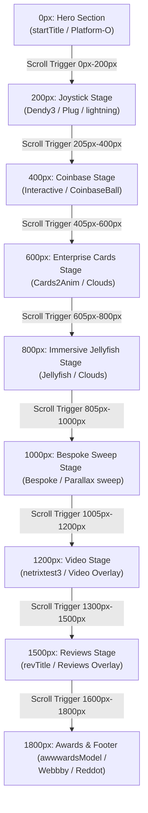

# Noomo Agency WebGL 滚动交互设计与物理动效大师蓝图 (Master Scroll Blueprint)

本篇文档将以 **滑动距离（Scroll Distance）** 为主线，深度解构 Noomo Agency 网站中 **3D 几何模型、SVG 转换的 3D 文字、摄像机运动轨迹（Camera Coordinates）** 以及 **物理动效参数（缓动、阻尼、近端裁剪面、自适应）**。

---

## 1. 核心 WebGL 物理与交互系统设计

在分析具体滚动距离之前，必须理解整站 WebGL 底层搭建的核心物理参数与设计巧思：

### 1.1 物理阻尼与运动惯性 (Scroll Smoothing & Inertia)
*   **技术方案**：使用 GSAP `ScrollSmoother` 插件，将浏览器原始、生硬的滚动事件进行拦截与重力差值模拟。
*   **物理表现**：在移动端或桌面端，阻尼系数被设为 `1.5`（移动端无物理滑轮时自适应为 `0.2`）。用户停止滑动后，摄像机会根据惯性继续平滑滑行 `0.5s - 1.0s`，杜绝了由于鼠标滚轮刻度带来的 3D 视野颤抖。
*   **物理同步**：在渲染循环中（`requestAnimationFrame`），通过 `window.controls.update()` 保持阻尼与惯性的实时帧更新（自动维持在 60fps/90fps 渲染级别）。

### 1.2 分段速度控制与缓动曲线 (Segmented Easing)
*   **非线性运动**：摄像机不是以恒定速度通过空间。整个长廊飞掠轨迹被分成多个子区间（Scroll Range）。
*   **缓动曲线**：全段统一绑定 `ease: "power2.inOut"`。
    *   **加速期**：在滑离一个停留区时，摄像机加速度由慢变快，产生推背感。
    *   **匀速飞行期**：在两个展区中间（例如 `200px - 205px`，`800px - 805px`）进行快速扫掠，忽略中间的无意义空白。
    *   **减速消隐期**：在接近下一个重点展示的 3D 模型前，摄像机以二次方衰减平滑刹车，直至平稳悬停。

### 1.3 屏幕尺寸自适应 (Responsive Adjustments)
*   **判定界限**：在滚动至 `1005px` 后的 Video/Reviews/Awards 阶段，JS 检测屏幕宽度是否大于 `1024px`。
*   **自适应坐标**：
    *   **桌面端 (Desktop)**：允许摄像机下降高度 `y` 至更低区间（如 `y: 11.44`），并在 Z 轴拉近镜头，以配合左右两侧宽屏排版。
    *   **移动端 (Mobile)**：摄像机坐标高度 `y` 保持锁定在较高位（如 `y: 20.43`），Z 轴回退，使画面纵向容纳更多的文字，防止 3D 模型或排版溢出屏幕剪切线。

### 1.4 SVG 转换为 3D 文字的秘密 (SVG-to-Mesh Translation)
*   **转换原理**：利用 Three.js `SVGLoader` 实时下载 `.svg` 轮廓文件，通过 `SVGLoader.createShapes()` 解析矢量顶点坐标，转换为二维 `ShapeGeometry` 填充网格。
*   **优点**：
    1.  **包体积缩减**：SVG 仅几 KB 大小，比预制 3D 文字 GLB 模型小 99% 以上。
    2.  **物理穿插**：文字被直接放置在 3D 世界笛卡尔坐标系中，具有真实 3D 物理遮挡关系（3D 模型能从文字缝隙穿过）。
    3.  **阻隔浏览器翻译**：由于文字是以 WebGL 三角网格渲染的像素，避开了 HTML DOM 树，Chrome 等浏览器进行整页翻译时**无法识别此文字为 HTML 文本**，从而保护了原始排版不被强制替换翻译。

### 1.5 镜头近端裁剪面与斜向穿透淡出 (Near clipping plane & Diagonal Fade-out)
*   **核心配置**：透视相机近端剪裁面（`near`）设为 `0.01`。
*   **淡出实现**：文字模型（如 "DESIGN THAT..."）均带有特定倾斜偏角（例如 `rotation.set(-0.05, -0.04, -0.002)`）。当用户滑动、摄像机向前飞行时，镜头在 Z 轴上逼近该倾斜平面。
*   当文字的某些顶点与相机的绝对 Z 轴距离小于 `0.01` 时，Three.js 的裁剪管道会立即停止渲染该区域。由于文字是倾斜的，随着摄像机前推，这道看不见的 **剪裁刀锋（Clipping plane）** 从左下角斜向扫到右上角，形成了非常高级的“物理滑移淡出”特效。

### 1.6 无缝摄影棚背景的协同运动 (Cyclorama Sync Movement)
*   **背景物体**：[BG2.glb](file:///Users/hanruochong/WebstormProjects/test/noomo_models/BG2.glb) 是一个巨大的 L 形摄影幕布（Cyclorama），贴有渐变纹理 `beckground_04min.jpeg`。
*   **协同平移与自转**：为了防止摄像机大范围飞行时穿透背景幕布的边缘，GSAP Timeline 对幕布的 `position` 和 `rotation` 进行了同步控制：
    *   当滑动距离在 `0px - 200px` 时，背景幕布的坐标由 `(4, -25, -20)` 平移至 `(16, -16, -20)`，同时 `rotation.y` 从 `0` 旋转至 `-0.87266`（大约 -50度）。
    *   **效果**：随着摄像机向左侧拉宽及俯冲，弧形背景墙也同步进行平移与偏转，完美将相机的视锥体限制在摄影棚的弧面内，避免网页露底。

---

## 2. 滚动距离（Scroll Distance）主线时间轴

整个交互以用户网页滚动值（`0px` 至 `1800px`）作为驱动量，每一像素均严格映射以下关键参数：

---

### 🟢 初始区间: `0px`（Hero Section）
网页的绝对起始点，呈现一个极简而充满空间感的摄影棚场景。

*   **摄像机参数**：
    *   位置 (Position)：`(2.093, -4.505, 44.601)`
    *   观察点 (LookAt Target)：`(4.093, -7.005, 0.601)`
*   **3D 模型资产**：
    *   `BG2.glb`：无缝背景幕布，位置在 `(4, -25, -20)`，缩放为 `(7, 7, 7)`。
    *   `Platform-O.glb`：漂浮的圆形底板（作为首屏浮游的基准）。使用物理透射玻璃材质 `window.glass`。
    *   `O.glb`：位置 `(0, -4.5, 21.5)`，做自转动画（360度旋转需要20秒）。
    *   `N.glb`：位置 `(5, -7.2, 21.5)`，做反向自转动画（360度旋转需要25秒）。
*   **SVG 3D 文字**：
    *   `startTitle.svg` ("DESIGN THAT ELEVATES YOUR...")。位置 `(-3, -4.3, 20)`，旋转角为 `(-0.057, -0.045, -0.003)`。
*   **物理与动效细节**：
    *   **首屏淡出**：随着页面从 `0px` 滚向 `100px`，HTML 层的 `.hero-text` 开始平移下落 `250px`（移动端为 `110vh`）并渐隐。
    *   **引导符消隐**：在滚动到视口的 `20%` 之前，底部的 "SCROLL" 闪烁提示淡出，并强制设置 `display: none` 以让出 GPU 资源。

---

### 🔵 阶段一: `0px` $\rightarrow$ `200px`（Joystick Stage）
摄像机从初始高空位置急速切入，俯冲到下方的游戏控制器展区。

*   **摄像机位移**：
    *   位置变化：`(2.093, -4.505, 44.601)` $\rightarrow$ `(-2.484, 3.733, 30.641)`
    *   观察点变化：`(4.093, -7.005, 0.601)` $\rightarrow$ `(7.958, -0.55, 1.019)`
*   **3D 模型资产**：
    *   加载 `Dendy3.glb`：怀旧红白机游戏手柄，置于右手侧，父级组坐标 `(20, 19.5, -1)`。手柄内部包含骨骼动画，自动循环播放按键下压动作，并在每个周期暂停 `1.0` 秒以拟真。
    *   加载 `Plug.glb`：金属玻璃材质插头，位于 `(2.84, 1.6, 2.32)`。
    *   加载 `lightning.glb`：能量闪电符号，位于 `(.21, 1.40, -3.58)`。
*   **SVG 3D 文字**：
    *   摄像机强力向前推入，在到达 `z: 30.6` 时，摄像机的主体已经斜向穿透了位于 `z: 20` 的 `startTitle.svg` 字体平面。
*   **物理与动效细节**：
    *   **近端切片淡出**：由于文字是具有偏角的，在穿越时触发了近端剪裁面（`near: 0.01`），屏幕上呈现出文字被斜切、渐次擦除的视觉剥离特效。
    *   **幕布运动**：背景 `BG2.glb` 在此区间同步向右移动并偏转 `y: -0.87rad`。

---

### 🔵 阶段二: `205px` $\rightarrow$ `400px`（Coinbase Stage）
摄像机进行横移与大仰角拉升，移向极具科技质感的 Coinbase 联名球体。

*   **摄像机位移**：
    *   位置变化：`(-2.484, 3.733, 30.641)` $\rightarrow$ `(-1.475, 9.953, 18.201)`
    *   观察点变化：`(7.958, -0.55, 1.019)` $\rightarrow$ `(14.485, 5.069, -2.278)`
*   **3D 模型资产**：
    *   加载 `CoinbaseBall2.glb`：中心展示小球，置于 `(7, 7, 7.1)`。
    *   加载 `Bitcoin.glb`：比特币符号，背景点缀，位于 `(-0.75, 1.54, -3.26)`。
    *   加载 `Sun.glb`：发光太阳模型，位于 `(2.5, 0.88, 1.15)`。
*   **SVG 3D 文字**：
    *   加载 `InteractiveSvg.svg` ("INTERACTIVE")。位置在 `(-1.83, 1.47, -4.7)`（相对父组），缩放为 `0.0067`。
*   **物理与动效细节**：
    *   **失重感模拟 (Zero-G Float)**：使用 GSAP 对 `CoinbaseBall2.glb` 注入单独的时间轴，使其在高度 `y` 轴上以 `sine.inOut` 曲线做 `0.8` 至 `1.0` 的上下漂浮自转，模拟太空中慢速无重力飘荡效果。
    *   **大俯仰视差**：相机的 `y` 轴高度急剧爬升（3.73 $\rightarrow$ 9.95），导致画面中的手柄、插头物理下落，Coinbase 球从上方滑入视野，形成陡峭的纵向透视。

---

### 🔵 阶段三: `405px` $\rightarrow$ `600px`（Enterprise Cards Stage）
摄像机沿螺旋轨迹向前推近，展示玻璃质感的卡片折射。

*   **摄像机位移**：
    *   位置变化：`(-1.475, 9.953, 18.201)` $\rightarrow$ `(0.783, 14.749, 13.3)`
    *   观察点变化：`(14.485, 5.069, -2.278)` $\rightarrow$ `(15.777, 12.603, -0.428)`
*   **3D 模型资产**：
    *   加载 `Cards2Anim.glb`：高透光亚克力卡片，位于组 `(10, 14, 0.7)` 内。
    *   加载 `Clouds.glb`：天空飘动的 3D 云层（金属粗糙度设定为 `.34` 以表现高亮边缘反射）。
*   **SVG 3D 文字**：
    *   加载 `enterpriseSvg.svg` ("ENTERPRISE")。位置为 `(-1.9, 2.3, -3.7)`。
*   **物理与动效细节**：
    *   **折射畸变 (Perspective Warp)**：摄像机极度靠近卡片面（Z轴到达 13.3，文字在 z: -3.7），此时透视视角畸变加剧，卡片侧面反光急剧偏转，将 Three.js 环境贴图（HDRI）的映射变化拉满，呈现水晶般的剔透反光。

---

### 🔵 阶段四: `605px` $\rightarrow$ `800px`（Immersive Jellyfish Stage）
摄像机继续拉升，进入发光水母的“深海世界”。

*   **摄像机位移**：
    *   位置变化：`(0.783, 14.749, 13.3)` $\rightarrow$ `(4.024, 22.301, 7.031)`
    *   观察点变化：`(15.777, 12.603, -0.428)` $\rightarrow$ `(17.443, 20.712, 0.431)`
*   **3D 模型资产**：
    *   加载 `Jellyfish.glb`：发光水母，位置在 `(-1, -4.3, 20)`。
    *   加载 `HeartLocation.glb`：指示图钉，位置在 `(3.8, 0.38, -0.6)`。
    *   加载 `Clouds.glb`（云层模型，进行以 30 秒为周期的缓动自转）。
*   **SVG 3D 文字**：
    *   加载 `immersive.svg` ("IMMERSIVE")。位置为 `(-3.3, 1.47, -4.7)`，缩放为 `0.0085`。
*   **物理与动效细节**：
    *   **实时骨骼变形**：通过 `AnimationMixer` 播放水母裙摆与触手的呼吸式摇摆动画（骨骼权重变形由 GPU 实时解算插值）。
    *   **半透明发光材质**：水母内部裙摆使用 `#ff2adf`（洋红色）霓虹发光色，外壳材质开启半透明（`transparent: true`, `opacity: 0.5`），完美模拟发光生物对背景光线的折射。
    *   **巅峰点俯瞰**：此时到达摄像机高度极限点 `y: 22.3`，镜头以大视角俯视水母和 "IMMERSIVE" 文字，文字在划出镜头边缘时，再次被相机的近端切片面优雅裁切。

---

### 🔵 阶段五: `805px` $\rightarrow$ `1000px`（Bespoke Sweep Stage）
全站飞掠速度最快、视觉冲击力最强的“大飞跃”区间。

*   **摄像机位移**：
    *   位置变化：`(4.024, 22.301, 7.031)` $\rightarrow$ `(23.346, 20.432, 2.102)`
    *   观察点变化：`(17.443, 20.712, 0.431)` $\rightarrow$ `(23.342, 20.293, 1.263)`
*   **3D 模型资产**：
    *   场景中的模型在此阶段通过 GSAP 大范围平移，为下一阶段的长廊扫掠腾出三维视口。
*   **SVG 3D 文字**：
    *   加载 `BespokeSvg.svg` ("BESPOKE")。位置在 `(3.87, 2.39, -6.08)`，缩放 `0.009`，偏转度极大。
*   **物理与动效细节**：
    *   **高速横移视差 (Velocity Parallax)**：在此区间（仅 200px 滚动像素内），摄像机的 X 轴坐标从 `4.0` 瞬移到 `23.3`。这导致前景物体与深处背景产生极其强烈的速度差，视野中的元素飞速向后划过，带来极强的推背感与速度体验，直到停留在右侧长廊区。

---

### 🔵 阶段六: `1005px` $\rightarrow$ `1200px`（Video Stage）
速度回归平缓，摄像机开始向后撤步并沉降，配合大屏幕的视频展示。

*   **摄像机位移**：
    *   位置变化（自适应）：
        *   **桌面端 (Desktop)**：`(23.346, 20.432, 2.102)` $\rightarrow$ `(23.321, 15.607, 3.911)`
        *   **移动端 (Mobile)**：保持在 `(23.346, 20.432, 2.102)` 高空悬停视角。
    *   观察点变化：`(23.342, 20.293, 1.263)` $\rightarrow$ `(23.301, 15.457, 1.984)`（桌面端）
*   **3D 模型资产**：
    *   加载 `netrixtest3.glb`：位于 `(20.8, 11, -5)`。
*   **物理与动效细节**：
    *   **防眩晕缓冲**：高速飞跃结束，摄像机下降高度 `y`（20.4 $\rightarrow$ 15.6），并且回退 Z 轴（2.1 $\rightarrow$ 3.9），镜头视场变宽。此时页面上的 HTML 视频卡片以淡入方式浮现，实现了 3D 摄影棚与 2D 内容展示层（DOM）的平滑衔接。

---

### 🔵 阶段七: `1300px` $\rightarrow$ `1500px`（Reviews Stage）
摄像机以极缓速度滑行，保障用户阅读排版文字的舒适度。

*   **摄像机位移**：
    *   位置变化：`(23.321, 15.607, 3.911)` $\rightarrow$ `(23.312, 14.16, 4.024)`
    *   观察点变化：`(23.301, 15.457, 1.984)` $\rightarrow$ `(23.292, 14.01, 2.097)`
*   **SVG 3D 文字**：
    *   加载 `revTitle.svg` ("REVIEWS")，缩放为 `0.0033`，位于 `(20.8, 11, -5)`。
*   **物理与动效细节**：
    *   **缓速微移**：在此区间内，摄像机仅有微小的垂直沉降（`y: 15.6 -> 14.1`），几乎处于静态。这使得 HTML 的客户评价卡片轮播不会受到 3D 运镜晃动的影响，避免引起视觉疲劳。

---

### 🔴 终点阶段: `1600px` $\rightarrow$ `1800px`（Awards & Footer Stage）
摄像机缓缓着陆，完成最终的 3D 运镜飞行。

*   **摄像机位移**：
    *   位置变化：`(23.312, 14.16, 4.024)` $\rightarrow$ `(23.292, 11.443, 4.236)`
    *   观察点变化：`(23.292, 14.01, 2.097)` $\rightarrow$ `(23.272, 11.293, 2.309)`
*   **3D 模型资产**：
    *   加载荣誉清单的 3D 奖杯资产：`awwwardsModel.glb`、`webbby.glb`、`reddot.glb`、`SFDF_op1.glb`。
*   **物理与动效细节**：
    *   **重力平稳落地**：当滚动条彻底拉到 `1800px` 的页面尽头时，摄像机坐标刚好平滑减速至最低点 `y: 11.44` 并彻底锁定。
    *   网页下方的大型 HTML 页脚、联系表单（Contact Form）以及社交媒体链接以传统网页形式展现，WebGL Canvas 作为艺术背景在底层静止衬托。
